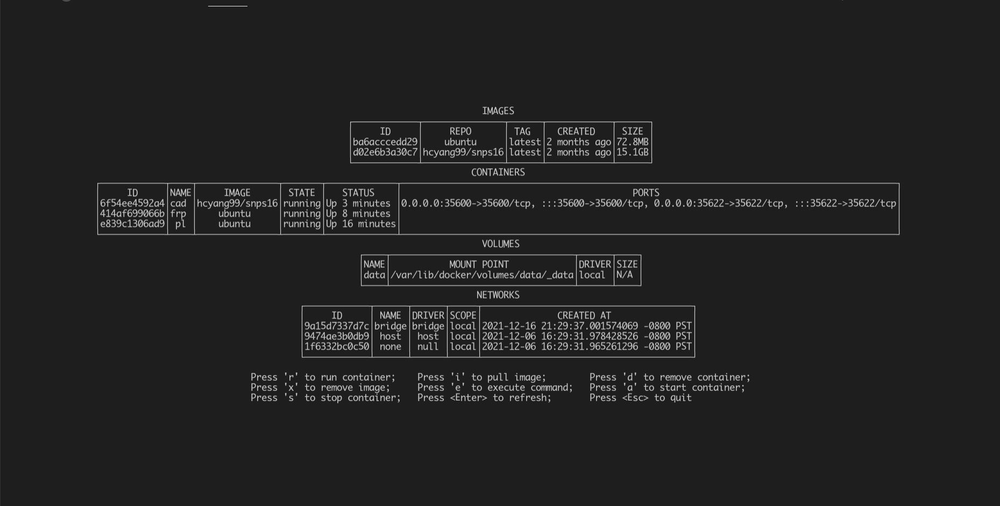
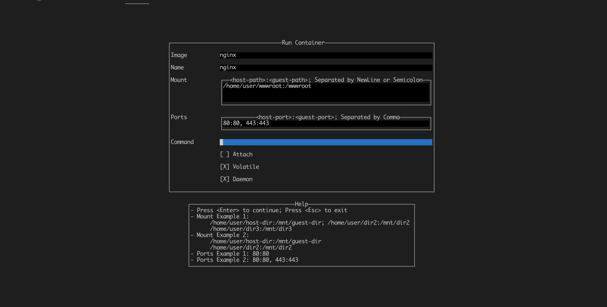

# Haskell Docker TUI
A TUI for docker implemented in Haskell, using [brick](https://github.com/jtdaugherty/brick).\
Authors: Haichao Yang, Jiayi Hu\
Idea originates from [skanehira/docui](https://github.com/skanehira/docui).

## Features
- docker pull / docker image rm
- docker run
- docker rm 
- docker start / docker stop
- docker exec

## Build \& Run
```shell
$ stack run
```

## Screenshots
### Main Menu

### Docker Run
- Supports state preserving on error / cancellation
- "Attach" option does nothing 


## Limitations
Major parts finished in 2 days ...
- Single-threaded program
- Coupled UI and backend
- Copies and pastes everywhere